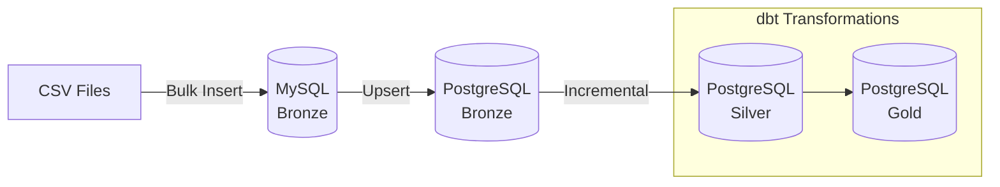

# Flight Price Analysis Pipeline

## Overview

An end-to-end data engineering pipeline using **Apache Airflow** and **dbt** with **Medallion Architecture** (Bronze → Silver → Gold) for analyzing Bangladesh flight price data.

### Key Features

- 🚀 **Optimized Performance**: Bulk inserts with 10,000 row chunks
- 🔄 **Incremental Load**: Upsert support for handling updates
- 📁 **Multi-CSV Support**: Process all CSVs in a folder
- 🔑 **Deduplication**: Composite hash key for unique bookings
- ⚡ **Incremental dbt**: Only processes changed data



## Architecture

| Layer | Database | Description |
|-------|----------|-------------|
| **Bronze** | MySQL → PostgreSQL | Raw data ingestion with upsert support |
| **Silver** | PostgreSQL | Cleaned data with incremental materialization |
| **Gold** | PostgreSQL | KPI and analytics tables |

---

## 🆕 Optimization Features (v2)

### 1. Incremental Load with Upsert

The pipeline now supports incremental loads using a **composite hash key**:

```
booking_hash = hash(airline + source + destination + departure_datetime + class + booking_source)
```

| Database | Strategy |
|----------|----------|
| MySQL | `INSERT ON DUPLICATE KEY UPDATE` |
| PostgreSQL | `INSERT ... ON CONFLICT DO UPDATE` |

### 2. Multi-CSV File Support

```python
CSV_FOLDER = '/opt/airflow/data/'
CSV_PATTERN = 'Flight_Price_*.csv'  # Processes all matching files
```

### 3. dbt Incremental Materialization

Silver layer only processes new/updated rows:
```sql
{{ config(materialized='incremental', unique_key='booking_hash') }}
```

---

## 🚀 RUN GUIDE

### Prerequisites

- Docker & Docker Compose installed
- At least 4GB RAM available for containers

### Step 1: Clone/Navigate to Project

```bash
cd flight-price-airflow-dbt
```

### Step 2: Add Your CSV Dataset

Place CSV files in the data folder:

```bash
mkdir -p include/data
cp /path/to/Flight_Price_*.csv include/data/
```

### Step 3: Start All Services

```bash
docker-compose up -d
```

Wait 2-3 minutes for services to initialize (dbt is installed on startup).

```bash
docker-compose ps
```

### Step 4: Access Airflow UI

1. Open http://localhost:8080
2. Login with:
   - **Username**: `airflow`
   - **Password**: `airflow`

### Step 5: Trigger the DAG

1. Find `flight_price_pipeline` in the DAG list
2. Click the ▶️ (Play) button to trigger a run
3. Monitor progress in the Graph view

---

## Pipeline Tasks

| Task | Description |
|------|-------------|
| `start` | Pipeline entry point |
| `load_csv_to_mysql` | Load CSVs with bulk insert + upsert |
| `validate_mysql_data` | Validate data quality + duplicate check |
| `transfer_to_postgres_bronze` | Transfer with upsert support |
| `run_dbt_transformations` | Build Silver + Gold layers (incremental) |
| `end` | Pipeline completion |

---

## ✅ TEST GUIDE

### Verify Bronze Layer (MySQL)

```bash
docker exec mysql mysql -u root -proot flight_bronze -e "SELECT COUNT(*) AS row_count FROM raw_flight_prices;"
```

**Expected**: ~57,000 rows

### Verify PostgreSQL Layers

```bash
docker exec postgres psql -U postgres -d analytics -c "
SELECT 'bronze.raw_flight_prices' AS table_name, COUNT(*) FROM bronze.raw_flight_prices
UNION ALL SELECT 'public_silver.stg_flight_prices', COUNT(*) FROM public_silver.stg_flight_prices
UNION ALL SELECT 'public_gold.avg_fare_by_airline', COUNT(*) FROM public_gold.avg_fare_by_airline;"
```

### Verify booking_hash Column

```bash
docker exec postgres psql -U postgres -d analytics -c "SELECT booking_hash, airline, source, destination FROM bronze.raw_flight_prices LIMIT 3;"
```

### Verify Incremental Processing

Check dbt logs for incremental messages:
```
Completed successfully.
Done. PASS=7 ERROR=0
```

---

## Silver Layer Transformations

| Transformation | Description |
|----------------|-------------|
| `booking_hash` | Unique composite key for deduplication |
| `duration_bucket` | Short (0-3h), Medium (3-6h), Long (6+h) |
| `booking_lead_bucket` | Last Minute, Short Notice, Standard, Early Bird |
| Data cleaning | Trims whitespace, parses dates, ensures non-negative fares |

---

## Gold Layer KPIs

| Model | Description |
|-------|-------------|
| `avg_fare_by_airline` | Average fare per airline |
| `avg_fare_by_class` | Average fare by travel class |
| `avg_fare_by_route` | Average fare per route with price-per-hour metric |
| `booking_count_by_airline` | Total bookings and market share |
| `top_routes` | Most popular routes |
| `seasonal_fare_variation` | Fare patterns by seasonality |

---

## 🔧 TROUBLESHOOTING GUIDE

### dbt Command Not Found

**Symptom**: `dbt: command not found`

**Note**: dbt is now automatically installed in the scheduler container on startup. If issue persists:
```bash
docker exec airflow-scheduler pip install dbt-postgres==1.7.0
```

### Database Connection Refused

1. Check containers are running: `docker-compose ps`
2. Wait 30-60 seconds for databases to initialize
3. Restart containers: `docker-compose restart`

### Incremental Merge Error

If you see `syntax error at or near "merge"`, ensure the dbt model uses `delete+insert` strategy (not `merge`) for PostgreSQL 13 compatibility.

### How to View Logs

**Airflow task logs**:
```bash
docker-compose logs airflow-scheduler --tail 100
```

**dbt logs**:
```bash
docker exec airflow-scheduler cat /opt/airflow/dbt_project/logs/dbt.log
```

---

## Project Structure

```
flight-price-airflow-dbt/
├── dags/
│   └── flight_price_pipeline.py    # Main DAG with optimizations
├── dbt_project/
│   ├── models/
│   │   ├── silver/
│   │   │   └── stg_flight_prices.sql    # Incremental model
│   │   ├── gold/                         # 6 KPI tables
│   │   └── schema.yml                    # Tests & docs
│   ├── profiles.yml
│   └── packages.yml
├── include/data/                         # CSV files folder
├── docker-compose.yml                    # With dbt auto-install
└── README.md
```

---

## Stopping the Pipeline

```bash
docker-compose down
```

To remove all data (for fresh start):

```bash
docker-compose down -v
```
