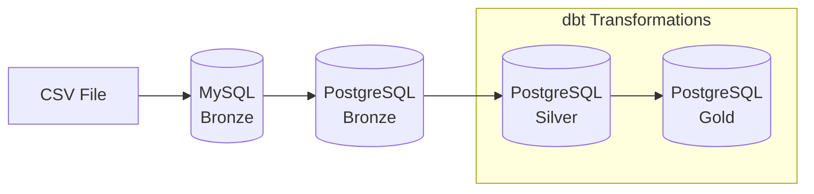

# Flight Price Analysis Pipeline

## Overview

An end-to-end data engineering pipeline using **Apache Airflow** and **dbt** with **Medallion Architecture** (Bronze → Silver → Gold) for analyzing Bangladesh flight price data.



## Architecture

| Layer | Database | Description |
|-------|----------|-------------|
| **Bronze** | MySQL → PostgreSQL | Raw data ingestion from CSV |
| **Silver** | PostgreSQL | Cleaned, validated, and standardized data |
| **Gold** | PostgreSQL | KPI and analytics tables |

---

## 🚀 RUN GUIDE

### Prerequisites

- Docker & Docker Compose installed
- At least 4GB RAM available for containers

### Step 1: Clone/Navigate to Project

```bash
cd flight-price-airflow-dbt
```

### Step 2: Add Your CSV Dataset

Place `Flight_Price_Dataset_of_Bangladesh.csv` in the data folder:

```bash
mkdir -p include/data
# Copy your CSV file to include/data/
cp /path/to/Flight_Price_Dataset_of_Bangladesh.csv include/data/
```

### Step 3: Start All Services

```bash
docker-compose up -d
```

Wait 2-3 minutes for all services to initialize. Check status:

```bash
docker-compose ps
```

All containers should show "Up" status.

### Step 4: Access Airflow UI

1. Open http://localhost:8080
2. Login with:
   - **Username**: `airflow`
   - **Password**: `airflow`

### Step 5: Trigger the DAG

1. Find `flight_price_pipeline` in the DAG list
2. Toggle the DAG to "On" (if paused)
3. Click the ▶️ (Play) button to trigger a run
4. Monitor progress in the Graph view

---

## ✅ TEST GUIDE

### Verify Bronze Layer (MySQL)

Check row count in MySQL:

```bash
docker exec -it mysql bash -c "mysql -u root -proot flight_bronze -e 'SELECT COUNT(*) AS row_count FROM raw_flight_prices;'"
```

**Expected**: ~57,000 rows (matching your CSV)

### Verify PostgreSQL Bronze

```bash
docker exec -it postgres bash -c "psql -U postgres -d analytics -c 'SELECT COUNT(*) FROM bronze.raw_flight_prices;'"
```

**Expected**: Same count as MySQL

### Verify Silver Layer

```bash
docker exec -it postgres bash -c "psql -U postgres -d analytics -c 'SELECT COUNT(*) FROM silver.stg_flight_prices;'"
```

**Expected**: Same count as Bronze

Check Ghana-like seasonality values:

```bash
docker exec -it postgres bash -c "psql -U postgres -d analytics -c 'SELECT DISTINCT seasonality_gh FROM silver.stg_flight_prices ORDER BY 1;'"
```

**Expected values**:
- BackToSchool
- ChaleWote_Week
- Christmas_NewYear
- Easter
- Eid_like
- Farmers_Day
- Hajj_like
- Homowo_Festival
- Independence_Day
- Regular

### Verify Gold Layer

Check all KPI tables have data:

```bash
docker exec -it postgres bash -c "psql -U postgres -d analytics -c '
SELECT 
  (SELECT COUNT(*) FROM gold.avg_fare_by_airline) AS avg_fare_rows,
  (SELECT COUNT(*) FROM gold.booking_count_by_airline) AS booking_count_rows,
  (SELECT COUNT(*) FROM gold.top_routes) AS top_routes_rows,
  (SELECT COUNT(*) FROM gold.seasonal_fare_variation) AS seasonal_rows,
  (SELECT COUNT(*) FROM gold.seasonal_fare_variation_gh) AS seasonal_gh_rows;
'"
```

**Expected**: All counts > 0

### Verify dbt Tests Passed

Check Airflow task logs for `run_dbt_transformations` - should show:
```
Completed successfully.
Done. PASS=XX
```

---

## 🔧 TROUBLESHOOTING GUIDE

### Database Connection Refused

**Symptom**: `Connection refused` errors in logs

**Solution**:
1. Check containers are running: `docker-compose ps`
2. Wait 30-60 seconds for databases to initialize
3. Restart containers: `docker-compose restart`

### Airflow Webserver Not Loading

**Symptom**: Can't access http://localhost:8080

**Solution**:
1. Check webserver logs: `docker-compose logs airflow-webserver`
2. Ensure port 8080 is not in use: `netstat -an | find "8080"`
3. Restart webserver: `docker-compose restart airflow-webserver`

### dbt Profile Errors

**Symptom**: `Could not find profile named 'flight_price'`

**Solution**:
1. Ensure profiles.yml exists in dbt_project folder
2. Check DBT_PROFILES_DIR environment variable is set
3. Verify file permissions

### Missing dbt_utils Package

**Symptom**: `Compilation Error: Package 'dbt_utils' not found`

**Solution**:
```bash
docker exec -it airflow-scheduler bash -c "cd /opt/airflow/dbt_project && dbt deps"
```

### Port Conflicts

**Symptom**: `Bind for 0.0.0.0:XXXX failed: port is already allocated`

**Solution**:
1. Stop conflicting service or change port in docker-compose.yml:
   - MySQL: 3307 (external)
   - PostgreSQL: 5433 (external)
   - Airflow: 8080

### How to View Logs

**Airflow task logs**:
- Via UI: Click task → Logs tab
- Via CLI: `docker-compose logs airflow-scheduler`

**Database logs**:
```bash
docker-compose logs mysql
docker-compose logs postgres
```

**dbt logs**:
```bash
docker exec -it airflow-scheduler bash -c "cat /opt/airflow/dbt_project/logs/dbt.log"
```

---

## Ghana-like Seasonality Mapping

This project maps the original Bangladesh seasonality to Ghana-like seasonal patterns based on departure dates.

| seasonality_gh | Date Range | Priority |
|----------------|------------|----------|
| Eid_like | From dataset Seasonality = Eid | 1 |
| Hajj_like | From dataset Seasonality = Hajj | 2 |
| ChaleWote_Week | Aug 10 – Aug 20 | 3 |
| Homowo_Festival | Aug 1 – Aug 31 | 4 |
| Christmas_NewYear | Dec 15 – Jan 10 | 5 |
| Independence_Day | Mar 1 – Mar 15 | 6 |
| Easter | Mar 15 – Apr 30 | 7 |
| Farmers_Day | Dec 1 – Dec 10 | 8 |
| BackToSchool | Jan 11 – Feb 15; Aug 15 – Sep 30 | 9 |
| Regular | Default | 10 |

> **Note**: This is an assumption-based seasonal mapping for educational purposes. Overlapping dates follow priority order (lower number = higher priority).

---

## Project Structure

```
flight-price-airflow-dbt/
├── dags/
│   └── flight_price_pipeline.py    # Main Airflow DAG
├── dbt_project/
│   ├── dbt_project.yml             # dbt configuration
│   ├── profiles.yml                # Database connection
│   ├── packages.yml                # dbt packages
│   └── models/
│       ├── silver/
│       │   └── stg_flight_prices.sql
│       ├── gold/
│       │   ├── avg_fare_by_airline.sql
│       │   ├── booking_count_by_airline.sql
│       │   ├── top_routes.sql
│       │   ├── seasonal_fare_variation.sql
│       │   └── seasonal_fare_variation_gh.sql
│       └── schema.yml              # Tests & docs
├── include/data/
│   └── Flight_Price_Dataset_of_Bangladesh.csv
├── docker-compose.yml
├── requirements.txt
└── README.md
```

---

## Stopping the Pipeline

```bash
docker-compose down
```

To remove all data (volumes):

```bash
docker-compose down -v
```
