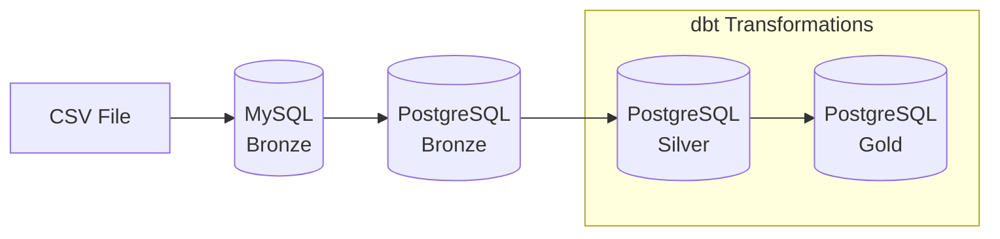

# Flight Price Analysis Pipeline

## Overview

An end-to-end data engineering pipeline using **Apache Airflow** and **dbt** with **Medallion Architecture** (Bronze → Silver → Gold) for analyzing Bangladesh flight price data.



## Architecture

| Layer | Database | Description |
|-------|----------|-------------|
| **Bronze** | MySQL → PostgreSQL | Raw data ingestion from CSV |
| **Silver** | PostgreSQL | Cleaned, validated, and standardized data |
| **Gold** | PostgreSQL | KPI and analytics tables |

---

## 🚀 RUN GUIDE

### Prerequisites

- Docker & Docker Compose installed
- At least 4GB RAM available for containers

### Step 1: Clone/Navigate to Project

```bash
cd flight-price-airflow-dbt
```

### Step 2: Add Your CSV Dataset

Place `Flight_Price_Dataset_of_Bangladesh.csv` in the data folder:

```bash
mkdir -p include/data
# Copy your CSV file to include/data/
cp /path/to/Flight_Price_Dataset_of_Bangladesh.csv include/data/
```

### Step 3: Start All Services

```bash
docker-compose up -d
```

Wait 2-3 minutes for all services to initialize. Check status:

```bash
docker-compose ps
```

All containers should show "Up" status.

### Step 4: Access Airflow UI

1. Open http://localhost:8080
2. Login with:
   - **Username**: `airflow`
   - **Password**: `airflow`

### Step 5: Trigger the DAG

1. Find `flight_price_pipeline` in the DAG list
2. Toggle the DAG to "On" (if paused)
3. Click the ▶️ (Play) button to trigger a run
4. Monitor progress in the Graph view

---

## Pipeline Tasks

| Task | Description |
|------|-------------|
| `start` | Pipeline entry point |
| `load_csv_to_mysql` | Load CSV into MySQL Bronze layer |
| `validate_mysql_data` | Validate data quality |
| `transfer_to_postgres_bronze` | Transfer to PostgreSQL |
| `run_dbt_transformations` | Build Silver + Gold layers |
| `end` | Pipeline completion |

---

## ✅ TEST GUIDE

### Verify Bronze Layer (MySQL)

Check row count in MySQL:

```bash
docker exec -it mysql bash -c "mysql -u root -proot flight_bronze -e 'SELECT COUNT(*) AS row_count FROM raw_flight_prices;'"
```

**Expected**: ~57,000 rows (matching your CSV)

### Verify PostgreSQL Bronze

```bash
docker exec -it postgres bash -c "psql -U postgres -d analytics -c 'SELECT COUNT(*) FROM bronze.raw_flight_prices;'"
```

**Expected**: Same count as MySQL

### Verify Silver Layer

```bash
docker exec -it postgres bash -c "psql -U postgres -d analytics -c 'SELECT COUNT(*) FROM silver.stg_flight_prices;'"
```

**Expected**: Same count as Bronze

Check duration buckets:

```bash
docker exec -it postgres bash -c "psql -U postgres -d analytics -c 'SELECT DISTINCT duration_bucket FROM silver.stg_flight_prices ORDER BY 1;'"
```

**Expected values**:
- Long (6+h)
- Medium (3-6h)
- Short (0-3h)

Check booking lead buckets:

```bash
docker exec -it postgres bash -c "psql -U postgres -d analytics -c 'SELECT DISTINCT booking_lead_bucket FROM silver.stg_flight_prices ORDER BY 1;'"
```

**Expected values**:
- Early Bird (30+ days)
- Last Minute (0-3 days)
- Short Notice (4-14 days)
- Standard (15-30 days)

### Verify Gold Layer

Check all KPI tables have data:

```bash
docker exec -it postgres bash -c "psql -U postgres -d analytics -c '
SELECT 
  (SELECT COUNT(*) FROM gold.avg_fare_by_airline) AS avg_fare_airline,
  (SELECT COUNT(*) FROM gold.avg_fare_by_class) AS avg_fare_class,
  (SELECT COUNT(*) FROM gold.avg_fare_by_route) AS avg_fare_route,
  (SELECT COUNT(*) FROM gold.booking_count_by_airline) AS booking_count,
  (SELECT COUNT(*) FROM gold.top_routes) AS top_routes,
  (SELECT COUNT(*) FROM gold.seasonal_fare_variation) AS seasonal;
'"
```

**Expected**: All counts > 0

### Verify dbt Tests Passed

Check Airflow task logs for `run_dbt_transformations` - should show:
```
Completed successfully.
Done. PASS=XX
```

---

## 🔧 TROUBLESHOOTING GUIDE

### Database Connection Refused

**Symptom**: `Connection refused` errors in logs

**Solution**:
1. Check containers are running: `docker-compose ps`
2. Wait 30-60 seconds for databases to initialize
3. Restart containers: `docker-compose restart`

### Airflow Webserver Not Loading

**Symptom**: Can't access http://localhost:8080

**Solution**:
1. Check webserver logs: `docker-compose logs airflow-webserver`
2. Ensure port 8080 is not in use: `netstat -an | find "8080"`
3. Restart webserver: `docker-compose restart airflow-webserver`

### dbt Command Not Found

**Symptom**: `dbt: command not found`

**Solution**:
```bash
docker exec -it airflow-scheduler bash -c "pip install dbt-postgres"
```

### dbt Profile Errors

**Symptom**: `Could not find profile named 'flight_price'`

**Solution**:
1. Ensure profiles.yml exists in dbt_project folder
2. Check DBT_PROFILES_DIR environment variable is set
3. Verify file permissions

### Port Conflicts

**Symptom**: `Bind for 0.0.0.0:XXXX failed: port is already allocated`

**Solution**:
1. Stop conflicting service or change port in docker-compose.yml:
   - MySQL: 3307 (external)
   - PostgreSQL: 5433 (external)
   - Airflow: 8080

### How to View Logs

**Airflow task logs**:
- Via UI: Click task → Logs tab
- Via CLI: `docker-compose logs airflow-scheduler`

**Database logs**:
```bash
docker-compose logs mysql
docker-compose logs postgres
```

**dbt logs**:
```bash
docker exec -it airflow-scheduler bash -c "cat /opt/airflow/dbt_project/logs/dbt.log"
```

---

## Silver Layer Transformations

| Transformation | Description |
|----------------|-------------|
| `duration_bucket` | Categorizes flights: Short (0-3h), Medium (3-6h), Long (6+h) |
| `booking_lead_bucket` | Categorizes booking lead time: Last Minute, Short Notice, Standard, Early Bird |
| Data cleaning | Trims whitespace, parses dates, ensures non-negative fares |

---

## Gold Layer KPIs

| Model | Description |
|-------|-------------|
| `avg_fare_by_airline` | Average fare per airline |
| `avg_fare_by_class` | Average fare by travel class (Economy/Business/First) |
| `avg_fare_by_route` | Average fare per route with price-per-hour metric |
| `booking_count_by_airline` | Total bookings and market share by airline |
| `top_routes` | Most popular routes by booking count |
| `seasonal_fare_variation` | Fare patterns by seasonality |

---

## Project Structure

```
flight-price-airflow-dbt/
├── dags/
│   └── flight_price_pipeline.py    # Main Airflow DAG
├── dbt_project/
│   ├── dbt_project.yml             # dbt configuration
│   ├── profiles.yml                # Database connection
│   ├── packages.yml                # dbt packages
│   └── models/
│       ├── silver/
│       │   └── stg_flight_prices.sql
│       ├── gold/
│       │   ├── avg_fare_by_airline.sql
│       │   ├── avg_fare_by_class.sql
│       │   ├── avg_fare_by_route.sql
│       │   ├── booking_count_by_airline.sql
│       │   ├── top_routes.sql
│       │   └── seasonal_fare_variation.sql
│       └── schema.yml              # Tests & docs
├── include/data/
│   └── Flight_Price_Dataset_of_Bangladesh.csv
├── docker-compose.yml
├── requirements.txt
└── README.md
```

---

## Stopping the Pipeline

```bash
docker-compose down
```

To remove all data (volumes):

```bash
docker-compose down -v
```
